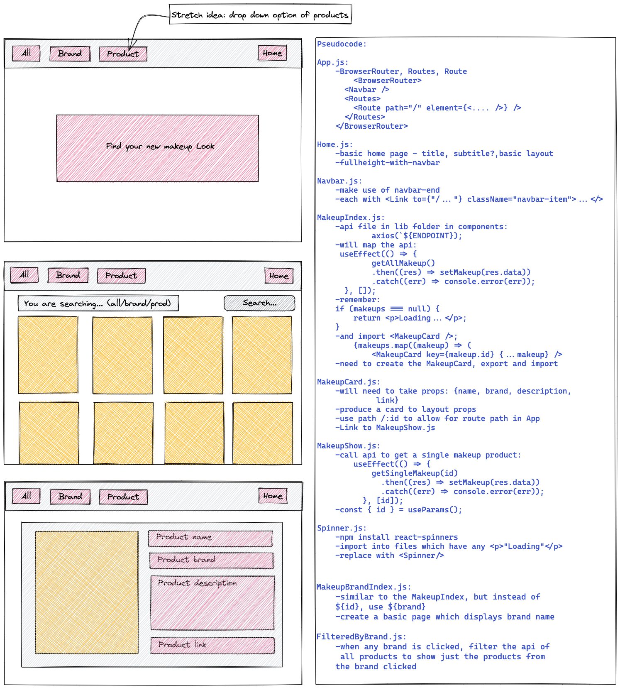

# Description

We had to make a React App using external APIs. We were in pairs for this task and worked off the same repository to create the final product. After seeing what public APIs were available to us, we decided on a makeup app. This would directly link you to the product as well as give you information on each product. Overall making finding your next makeup choice easier as there is a cast amount of choice.

# Deployment link

https://exploremakeup.netlify.app

# Timeframe & Working Team (Solo/Pair/Group)

This project was done in a pair, I was working with Parul Singh. We both worked off the same repository and divided up the project to complete the tasks. The time frame was 48h.

# Technologies Used

We used GitHub, Bulma, React.js, SCSS and Postman. Postman and Github were ways to view the APIs and collaborate with work. React.js, Bulma and SCSS were used to create the React App.

For planning we used: Zoom, Slack and Excalidraw

# Brief

Overview

- The second project is to build a React application that consumes a public API.
  Technical Requirements
- Your app must:
  - Consume a public API – this could be anything but it must make sense for your project.
  - Have several components - At least one classical and one functional.
  - The app can have a router - with several "pages", this is up to your discretion and if it makes sense for your project.
  - Include wireframes - that you designed before building the app.
  - Be deployed online and accessible to the public.

# Planning

Technologies used: Slack; for updates on progress. Zoom; for standups and through the day calling. Excalidraw; for visual planning.

The first thing we did was look through the public APIs to find one we thought was interesting. Once this was found and we checked it on Postman we started to use Excalidraw to plan a wire frame of what we would do.

This also included some stretch ideas. Once this was done we moved onto pseudocode. We wrote out a rough outline of what each page would need in it as well as important functions to be included. This then led to box-timing and dividing up of the tasks, with the knowledge this could be flexible depending on how long each task took in reality.



We divided up the tasks to have enough time to finish the project. We knew we would have to do paired programming to produce a basic App.js page and NavBar.js as this would be the basis of most pages after that. We then decided I would take the MakeupIndex, MakeupCard, api and Spinner while Parul took the Navbar and the Home. We would then decide how to further allocate the tasks as we progressed. I then lead the Home, creating the bulma.scss and main.scss then LipStick and ProductCard (which I later merged with MakeupCard so I wasn’t repeating myself), and the joining of the products to the MakeupCard as Parul worked on Blush, Eyebrows, Foundation, Mascara and SearchBar. The allocation of these tasks were done through communicating what we wanted to do as well as things we thought would be good to do to help us improve.

# Build/Code Process

The section I started with was the MakeupIndex. For this I knew I would need to also make an api file where I stored the base url as well as the function to get the data.

```js
useEffect(() => {
  getAllMakeup()
    .then((res) => setMakeups(res.data))
    .catch((err) => console.log(err));
}, []);
```

I used useEffect and the exported function to get data to set makeups as the data from the API.

```js
{
  makeups &&
    filterMakeups().map((makeup) => {
      if (makeup.id > 0 && makeup.id < 129) {
        return (
          <MakeupCard
            key={makeup.id}
            name={makeup.name}
            image={makeup.image_link}
            brand={makeup.brand}
            prodLink={makeup.product_link}
            tag={makeup.tag_list}
            description={makeup.description}
          />
        );
      }
    });
}
```

I then mapped the data and created a MakeupCard from each product which included a name, image, brand, link and description. I added in an if statement which meant only the first 129 products were shown. This was for multiple reasons. Firstly, there were over 1000 products on the API and so the loading page was very slow, and secondly, some of the image links were broken, so this was done to avoid having missing pictures on our final page. I then had to make the Makeup Card, this was a function which took all the arguments stated above:

```js
const MakeupCard = ({ name, image, brand, tag, prodLink, description }) =>
```

Which was exported to be used in the MakeupIndex.

We then discovered that the individual card for each makeup would not be possible, so after discussion we thought a dropdown menu on the navbar would be a good thing to add in. I made the first item which was the Lipstick. I did this by adding in a function on the api file which allowed only the products with the product_type of lipstick. Then created a LipStick.js file. This was very similar to the MakeupIndex, but used the “getLipStick()” function to only include the lipstick products.

```js
export const getLipStick = () =>
  axios.get(`${MAKEUP_ENDPOINT}?product_type=lipstick`);
```

This function required me to look at the documentation of the API in order to see what the URL of the lipsticks would be. It took a “?product_type=” to filter.

# Challenges

We experienced some challenges with the API and the way in which you can search and filter the data. From our planning we had wanted to do a single makeup card where you can see the info for each makeup but due to some inconsistencies in the way the data is stored this was not possible. We had to think quickly on our feet to come up with another idea which would also showcase what we had learnt in React. We decided to do a drop down menu on the navbar which would take you to different products on the API based on brand.

I also had to add in an if statement on the MakeupIndex to only allow some of the data to be shown. Initially the data was slow to load and a lot of the images in direct view did not appear due to broken links. Instead of allowing the page to look this way I wanted to add in a line of code which would reduce the data so there was less and it contained only products which had images. I played around with the values a bit to see which ones looked good and gave a variety before settling on 0-129 for the MakeupIndex.

This was the first group project and it was definitely a learning curve. We had to learn very quickly how to work in the same repository and how to divide up work and ask for help

# Wins

I am proud of the visual aspect of the project. I added a main.scss page which allowed for some more styles to be added as some of the bulma colours could be quite limited. I also added in some more media queries for things like the navbar which was hard to make work with a drop down on a tablet or phone.

```css
@media only screen and (max-width: 500px) {
  .FrontPage {
    .TitleText {
      font-size: 55px;
      padding-bottom: 150px;
    }
    .SubtitleText {
      font-size: 40px;
      color: rgb(242, 51, 223);
      font-weight: 600;
      padding-bottom: 260px;
    }
    .hero-body {
      opacity: 0.8;
    }
  }
}

@media only screen and (max-width: 1200px) {
  .Navbar {
    display: none;
  }
}
```

This code section meant the Home page was readable and the navbar didn’t take up half the screen when on a phone or tablet.

I’m also proud of the smaller details I added in which help build the page overall, such as the Spinner for loading pages or the merging of ProductCard and MakeupCard. I initially made a ProductCard file which presented all the data for each product within the brand type on the drop down. However, I realised that this card was almost identical to the MakeupCard I already produced. So instead of repeating myself, to make the code more readable I merged the ProductCard and MakeupCard.

# Key Learnings/Takeaways

I think a key learning point from here would definitely be paired programming. At first I thought this would be a daunting experience but it was actually extremely helpful to have an extra set of eyes on whatever code you were writing. We only started using react the week before this project and I feel much more confident in using react now, especially after working in a pair and having to explain what you were doing or helping the other person!

# Bugs

There is a bug in the search bar, if you search for “blush” or “foundation” the results are blank. We know there is a product_type for both of these as we have them included on the drop down menu. This would be something that would require us looking into, it may be due to the way the API is sorted and, like with the “brand?.”, we added the ? as not all the products had a brand.

# Future Improvements

We could add in some more products in the drop down menu to cover all the available products in the API. This would give people more idea of the full range of products available and help them with any searches. It could also be a cool thing to do if you could save products which you like so you can find them again at a later date. Also adding gradual loading so that all the data could be shown, for this we would load the first 100 to make the wait time minimal. Once the user has scrolled down a certain point, the page would load the next 100 products.
